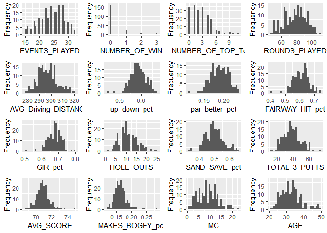
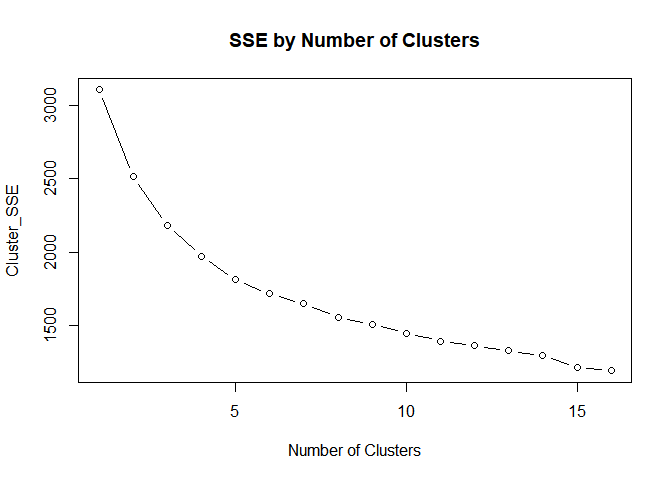
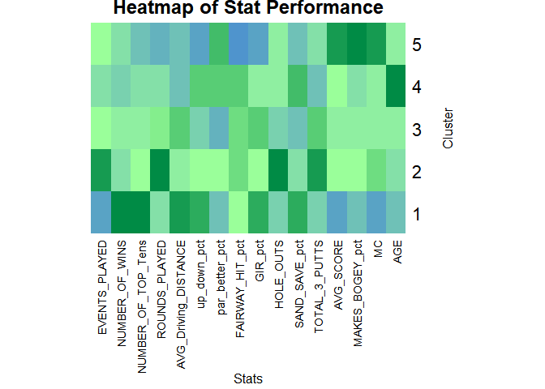
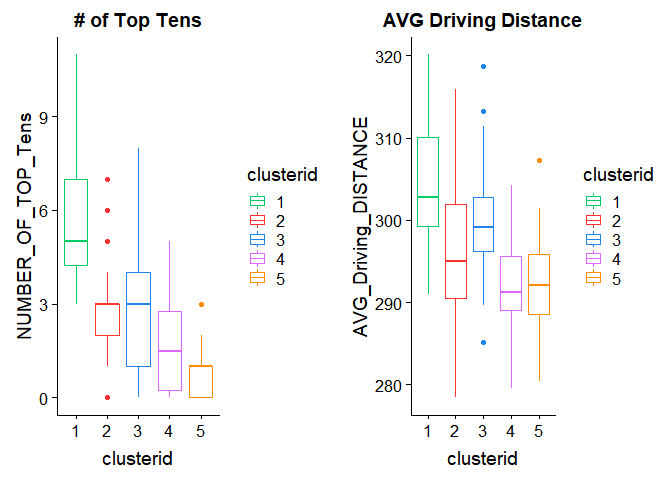
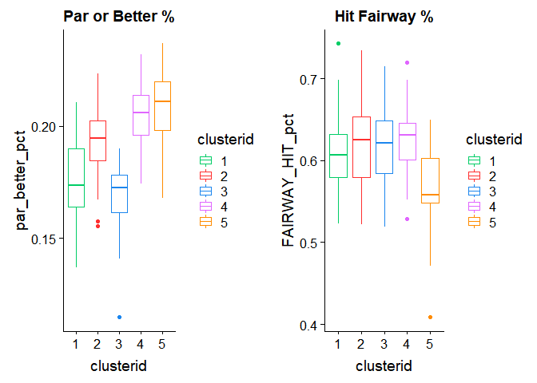
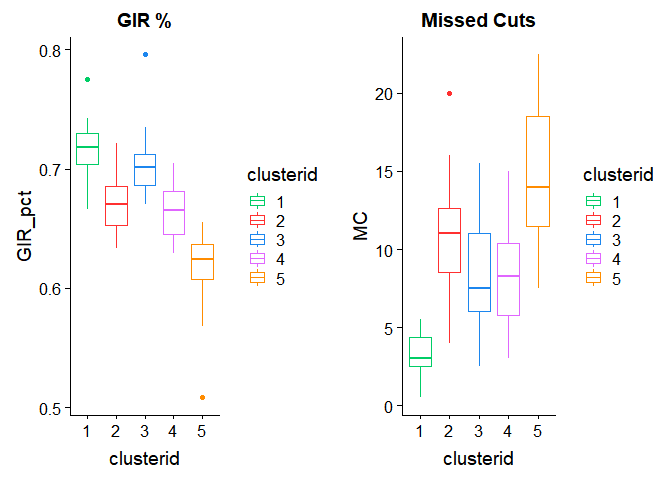
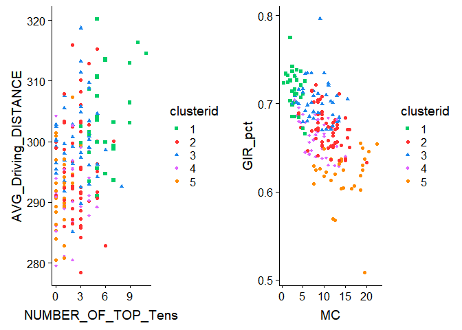
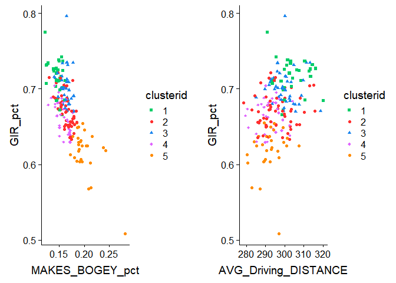

Clustering PGA Tour Players using K-Means
================
Blog Post 1: Brandon Wronker
November 29, 2018

``` r
# Set Working Directory
setwd("C:/Users/bwronker/OneDrive/Documents/MSBA UTenn/BZAN 552 Multivariate/Posts")

# Read in our PGA Tour Stats Data
full_stats <- read.csv("Post_PGA.csv", header = TRUE)

# We have 195 Golfers in our dataset along with 69 variables.
dim(full_stats)
```

    ## [1] 195  69

**One** interesting stat that we do not have in this dataset is Missed Cuts. In golf, each tournament is played over the course of 4 rounds. After 2 round, the field is reduced to the top performers in the tournament up until that point (using various methods - typically the top x players in the tournament). So, by determining how many round a players SHOULD have played (the \# of events played \* 4) compared how many they actually played, we can determine how many rounds they missed. Rounds missed divided by 2 will tell us how many Missed Cuts they had.

``` r
full_stats$MC <- ((full_stats$EVENTS_PLAYED*4)-full_stats$ROUNDS_PLAYED)/2

# Let's make some more variables out of the data that we have
full_stats$up_down_pct <- full_stats$UP_AND_DOWN_./100
full_stats$SAND_SAVE_pct <- full_stats$SAND_SAVE./100
full_stats$FAIRWAY_HIT_pct <- full_stats$FAIRWAY_HIT_./100
full_stats$par_better_pct <- full_stats$PAR_OR_BETTER/full_stats$HOLES_PLAYED
full_stats$MAKES_BOGEY_pct <- full_stats$MAKES_BOGEY./100
full_stats$GIR_pct <- 1-(full_stats$MISSED_GIR/full_stats$HOLES_PLAYED)

##
colnames(full_stats)[colSums(is.na(full_stats)) > 0]
```

    ## [1] "POINTS_BEHIND_LEAD"

``` r
full_stats[rowSums(is.na(full_stats)) > 0, 1]
```

    ## [1] Bryson DeChambeau
    ## 195 Levels: Aaron Baddeley Aaron Wise Abraham Ancer ... Zecheng Dou

**Our** dataset only has one NA and it is in the column: "Points Behind Lead". This is due to Bryson DeChambeau being the leader in points at the time this data was recorded. Because we do not need this variable for our analysis (and we would like to keep Bryson's records) we will simply remove this column from our dataset. We will also remove several other columns that we are not interested in for this analysis.

``` r
full_stats <- full_stats[, c("Player", "EVENTS_PLAYED", 
                             "NUMBER_OF_WINS", "NUMBER_OF_TOP_Tens",  
                             "ROUNDS_PLAYED",  "AVG_Driving_DISTANCE", "up_down_pct", 
                             "par_better_pct", "FAIRWAY_HIT_pct", "GIR_pct", 
                             "HOLE_OUTS", "SAND_SAVE_pct", "TOTAL_3_PUTTS", 
                             "AVG_SCORE", "MAKES_BOGEY_pct", "MC", "AGE")]


#install.packages("DataExplorer")
library(DataExplorer)
DataExplorer::plot_histogram(full_stats)
```



``` r
# Check out the structure of the new dataset
str(full_stats)
```

    ## 'data.frame':    195 obs. of  17 variables:
    ##  $ Player              : Factor w/ 195 levels "Aaron Baddeley",..: 1 2 3 4 5 6 7 8 9 10 ...
    ##  $ EVENTS_PLAYED       : int  27 27 29 24 28 20 24 17 26 27 ...
    ##  $ NUMBER_OF_WINS      : int  0 1 0 0 0 0 0 0 1 1 ...
    ##  $ NUMBER_OF_TOP_Tens  : int  1 4 5 3 1 3 2 3 5 5 ...
    ##  $ ROUNDS_PLAYED       : int  84 82 94 88 86 74 77 63 78 93 ...
    ##  $ AVG_Driving_DISTANCE: num  296 303 296 290 306 ...
    ##  $ up_down_pct         : num  0.621 0.566 0.632 0.59 0.545 ...
    ##  $ par_better_pct      : num  0.216 0.165 0.206 0.177 0.175 ...
    ##  $ FAIRWAY_HIT_pct     : num  0.522 0.633 0.631 0.652 0.577 ...
    ##  $ GIR_pct             : num  0.652 0.709 0.674 0.7 0.679 ...
    ##  $ HOLE_OUTS           : int  20 11 13 12 8 7 15 4 15 10 ...
    ##  $ SAND_SAVE_pct       : num  0.562 0.488 0.544 0.481 0.424 ...
    ##  $ TOTAL_3_PUTTS       : int  35 52 46 37 47 61 29 25 31 48 ...
    ##  $ AVG_SCORE           : num  70.8 70.3 70.7 70.8 71.4 ...
    ##  $ MAKES_BOGEY_pct     : num  0.162 0.165 0.148 0.156 0.169 ...
    ##  $ MC                  : num  12 13 11 4 13 3 9.5 2.5 13 7.5 ...
    ##  $ AGE                 : int  37 22 27 30 26 38 47 36 31 29 ...

``` r
# Scale data
full_stats_scale <- full_stats
full_stats_scale[,2:17] <- scale(full_stats[,2:17])
```

``` r
# Now, let's apply a k-means algorithm using the most interpretable k. 
set.seed(68)
stats_k <- kmeans(full_stats_scale[,2:17], 5)

stats_k$center
```

    ##   EVENTS_PLAYED NUMBER_OF_WINS NUMBER_OF_TOP_Tens ROUNDS_PLAYED
    ## 1   -1.14191919     1.15523815         1.43022501   -0.49805834
    ## 2    1.03326792    -0.22340717        -0.00382680    0.99708206
    ## 3   -0.09552019    -0.06845856        -0.06366908    0.01716813
    ## 4   -0.44578915    -0.30403653        -0.41606421   -0.41104666
    ## 5   -0.13833959    -0.29094887        -0.85603858   -0.92306082
    ##   AVG_Driving_DISTANCE up_down_pct par_better_pct FAIRWAY_HIT_pct
    ## 1           0.87244232  0.97222848     -0.6069870      -0.0493837
    ## 2          -0.09633011  0.03098781      0.1613175       0.1765299
    ## 3           0.38506705 -0.51836142     -0.9493991       0.1294823
    ## 4          -0.59904304  0.70474633      0.7197582       0.3106424
    ## 5          -0.59131123 -1.05124276      0.9142336      -0.8264236
    ##      GIR_pct  HOLE_OUTS SAND_SAVE_pct TOTAL_3_PUTTS   AVG_SCORE
    ## 1  1.0303030 -0.5127880     0.6902759    -0.5791154 -1.39146780
    ## 2 -0.1222814  0.9176107    -0.1740932     0.7499813  0.03164587
    ## 3  0.6864815 -0.4744322    -0.4111235     0.2525273 -0.16305894
    ## 4 -0.3096763 -0.1883428     0.6271072    -0.6907929  0.03746855
    ## 5 -1.4808001 -0.2749818    -0.4593383    -0.4167421  1.53451957
    ##   MAKES_BOGEY_pct         MC         AGE
    ## 1     -0.92214340 -1.3033673 -0.21531615
    ## 2     -0.05010429  0.3441962 -0.10295692
    ## 3     -0.12617705 -0.1989433 -0.03498134
    ## 4     -0.38386092 -0.1777386  0.44537342
    ## 5      1.63997935  1.1607199 -0.04478214

``` r
# Although this looks like a comprehensive number of clusters, let's try finding where our SSE is minimized and determine the appropriate number of clusters that way!

Cluster_SSE <- rep(NA, 10) 
Cluster_SSE[1] <- stats_k$totss 
for(k in 2:16){   stats_k <- kmeans(full_stats_scale[,2:17], k)
                  Cluster_SSE[k] <- stats_k$tot.withinss    }

par(mfrow=c(1,1))

plot(1:16, Cluster_SSE, type="b", xlab="Number of Clusters", main = "SSE by Number of Clusters")
```



``` r
# Based on this plot, it looks like 5 clusters does a great job of lowering our SSE while poviding clusters that are easily interpretable.

set.seed(68)
stats_k <- kmeans(full_stats_scale[,2:17], 5)
stats_k$size
```

    ## [1] 30 56 45 34 30

``` r
# Add the cluster numbers to the dataset as a column ####

full_stats$clusterid <- factor(stats_k$cluster)
full_stats_scale$clusterid <- factor(stats_k$cluster)
```

``` r
# Let's look at a heatmap of our scaled data to determine the makeup of our clusters!

colfunc <- colorRampPalette(c("steelblue3", "palegreen1", "springgreen4"))
heatmap(stats_k$center, Colv = NA, Rowv = NA, scale = "column", col = colfunc(15), xlab="Stats", ylab="Cluster", main="Heatmap of Stat Performance", margins = c(12,4))
```



**What's inside each cluster?**

**Cluster 1** This cluster is made up of our TOP performing golfers. \#1 in Number of Wins, Number of Top Tens, Driving Distance, GIR %, and Average Score (lower is better).

**Cluster 2** This cluster has many categories that fall in the middle of the pack. They do, however, play in the most events and rounds, as well as have the most hole outs and most three putts. This makes sence because they most likely play the most holes.

**Cluster 3** This category is the MOST average of all the clusters. It is the worst performing in Pars or better and one of the worst performing in Sand Saves.

**Cluster 4** This cluster is clearly the OLDEST. They do well around the greens with high Up & Down PCT and high Sand Saves. They do not drive the ball very far or win very often.

**Cluster 5** This cluster is made up of our WORST performing golfers. It is close to the lowest in Number of Wins and Top Tens. They hit the least fairways by far. They make the most bogey and Miss Cuts more than any other cluster.

``` r
#### Make visualizations of certain variables colored by cluster using ggplot ####
#install.packages("cowplot")
library(ggplot2)
require(cowplot)
```

    ## Loading required package: cowplot

    ## 
    ## Attaching package: 'cowplot'

    ## The following object is masked from 'package:ggplot2':
    ## 
    ##     ggsave

``` r
colors <- c("springgreen3", "firebrick1", "dodgerblue2", "mediumorchid1", "darkorange")

box1 <- ggplot(data = full_stats, aes(x = clusterid, y = NUMBER_OF_TOP_Tens, color = clusterid)) + 
 geom_boxplot(aes(shape = clusterid)) + scale_color_manual(values = colors) + ggtitle("# of Top Tens")

box2 <- ggplot(data = full_stats, aes(x = clusterid, y = AVG_Driving_DISTANCE, color = clusterid)) + 
 geom_boxplot(aes(shape = clusterid)) + scale_color_manual(values = colors) + ggtitle("AVG Driving Distance")

box3 <- ggplot(data = full_stats, aes(x = clusterid, y = par_better_pct, color = clusterid)) + 
 geom_boxplot(aes(shape = clusterid)) + scale_color_manual(values = colors) + ggtitle("Par or Better %")

box4 <- ggplot(data = full_stats, aes(x = clusterid, y = FAIRWAY_HIT_pct, color = clusterid)) + 
 geom_boxplot(aes(shape = clusterid)) + scale_color_manual(values = colors) + ggtitle("Hit Fairway %")

box5 <- ggplot(data = full_stats, aes(x = clusterid, y = GIR_pct, color = clusterid)) + 
 geom_boxplot(aes(shape = clusterid)) + scale_color_manual(values = colors) + ggtitle("GIR %")

box6 <- ggplot(data = full_stats, aes(x = clusterid, y = MC, color = clusterid)) + 
 geom_boxplot(aes(shape = clusterid)) + scale_color_manual(values = colors) + ggtitle("Missed Cuts")

cowplot::plot_grid(box1, box2)
```



``` r
cowplot::plot_grid(box3, box4)
```



``` r
cowplot::plot_grid(box5, box6)
```



``` r
#### Make visualizations of certain variables colored by cluster using ggplot ####

plot1 <- ggplot(data = full_stats, aes(x = NUMBER_OF_TOP_Tens, y = AVG_Driving_DISTANCE, color = clusterid )) + 
 geom_point(aes(shape = clusterid)) + scale_color_manual(values = colors) + scale_shape_manual(
values = c(15:19)) 

plot2 <- ggplot(data = full_stats, aes(x = MC, y = GIR_pct, color = clusterid )) + 
 geom_point(aes(shape = clusterid)) + scale_color_manual(values = colors) + scale_shape_manual(
values = c(15:19))

cowplot::plot_grid(plot1, plot2)
```



``` r
full_stats[which(full_stats$NUMBER_OF_TOP_Tens == 8),1]
```

    ## [1] Brian Harman
    ## 195 Levels: Aaron Baddeley Aaron Wise Abraham Ancer ... Zecheng Dou

``` r
full_stats[which(full_stats$AVG_Driving_DISTANCE > 315),1]
```

    ## [1] Luke List     Rory McIlroy  Tom Lovelady  Tony Finau    Trey Mullinax
    ## 195 Levels: Aaron Baddeley Aaron Wise Abraham Ancer ... Zecheng Dou

**We** can see here that GIR % is very important when is comes to not Missing Cuts. There is also a trend in golf nowadays where the longer hitters are performing the best. Brian Harman has an interesting stat that we can see in the plot above. He has a lot of top tens but doesn't drive the ball as far as the other top performers. We can also see that Rory McCilroy averaged an amazing 320 yards off the tee!

``` r
plot3 <- ggplot(data = full_stats, aes(x = MAKES_BOGEY_pct, y = GIR_pct, color = clusterid )) + 
 geom_point(aes(shape = clusterid)) + scale_color_manual(values = colors) + scale_shape_manual(
values = c(15:19))

plot4 <- ggplot(data = full_stats, aes(x = AVG_Driving_DISTANCE, y = GIR_pct, color = clusterid )) + 
 geom_point(aes(shape = clusterid)) + scale_color_manual(values = colors) + scale_shape_manual(
values = c(15:19))

cowplot::plot_grid(plot3, plot4)
```



``` r
full_stats[which(full_stats$GIR_pct == min(full_stats$GIR_pct)),1]
```

    ## [1] Smylie Kaufman
    ## 195 Levels: Aaron Baddeley Aaron Wise Abraham Ancer ... Zecheng Dou

``` r
full_stats[which(full_stats$GIR_pct == max(full_stats$GIR_pct)),1]
```

    ## [1] Padraig Harrington
    ## 195 Levels: Aaron Baddeley Aaron Wise Abraham Ancer ... Zecheng Dou

**We** can see from these plots that driving the ball far off the tee often results in a higher GIR %, which we know is important for overall performance in tournament. Smylie Kaufman is one of the worst on tour in GIR % despite being an average driver of the ball. Surprisingly, Padraig Harrington hit the most GIR, although he has not been as relevant on tour in several years.

**THANK YOU FOR READING!**
