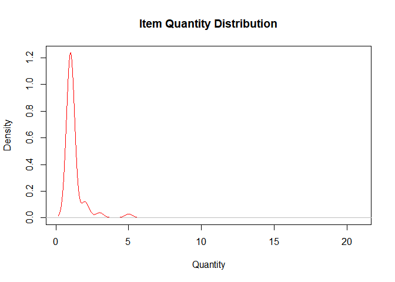
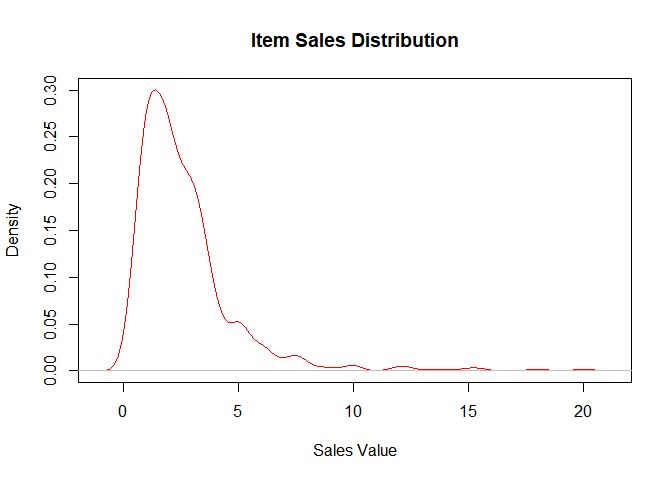
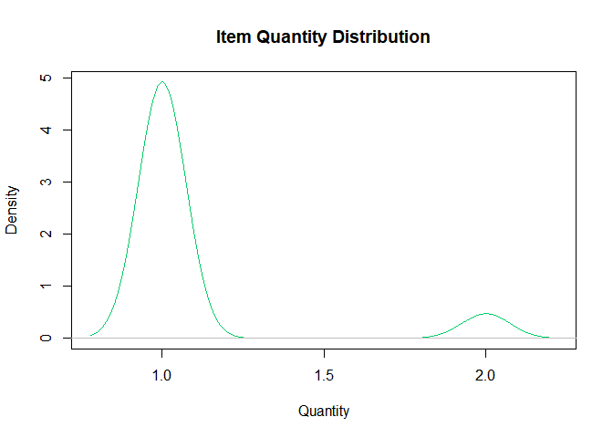
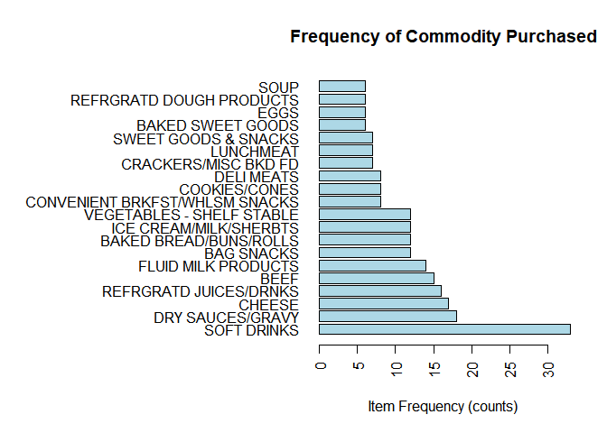

```r
# Set Working Directory
setwd("C:/Users/bwronker/OneDrive/Documents/MSBA UTenn/BZAN 552 Multivariate/Posts")

# Read in our Product & Transactional datasets
prod <- read.csv("product.csv", header = TRUE, colClasses = c("factor",
                                                              "factor",
                                                              "factor",
                                                              "factor",
                                                              "factor"))

transactions <- read.csv("retail.csv", header = TRUE, colClasses = c("factor",
                                                              "factor",
                                                              "factor",
                                                              "factor",
                                                              "integer",
                                                              "numeric",
                                                              "numeric",
                                                              "numeric",
                                                              "integer"))
```


```r
## Preprocessing

# Join Tables on Product ID so that we have full product descriptions in our baskets
transfull <- merge(transactions, prod, by = "PRODUCT_ID")

# Let's narrow down our dataset by selecting the most relevant variables
transfull <- transfull[, c("household_key", "BASKET_ID", 
                           "PRODUCT_ID", "MANUFACTURER", 
                           "DEPARTMENT", "BRAND", "COMMODITY_DESC", 
                           "SUB_COMMODITY_DESC", 
                           "QUANTITY", "SALES_VALUE")]

# Let's take a closer look at our quantitative variables
summary(transfull[,c(9,10)])
```

```
##     QUANTITY       SALES_VALUE    
##  Min.   : 1.000   Min.   : 0.150  
##  1st Qu.: 1.000   1st Qu.: 1.250  
##  Median : 1.000   Median : 2.000  
##  Mean   : 1.258   Mean   : 2.679  
##  3rd Qu.: 1.000   3rd Qu.: 3.330  
##  Max.   :20.000   Max.   :20.000
```

```r
#install.packages("outliers")
library(outliers)

#### Identify outliers and oddities in Quantity

trans_quant <- transfull[,9]

plot(density(trans_quant), col = "red", main = "Item Quantity Distribution", xlab = "Quantity")
```

<!-- -->

```r
grubbs.result <- grubbs.test(trans_quant)
grubbs.result$p.value
```

```
## [1] 0
```

```r
grubbs.result$alternative
```

```
## [1] "highest value 20 is an outlier"
```

```r
#### Identify outliers and oddities in Sales Value

trans_sales <- transfull[,10]

plot(density(trans_sales), col = "red", main = "Item Sales Distribution", xlab = "Sales Value")
```

<!-- -->

```r
grubbs.result <- grubbs.test(trans_sales)
grubbs.result$p.value
```

```
## [1] 1.8332e-12
```

```r
grubbs.result$alternative
```

```
## [1] "highest value 20 is an outlier"
```

**After seeing these results,** let's go ahead and remove some of the baskets with unusually high quantities in their baskets and check to see if our plot looks more normal!


```r
#### Remove outliers
transfull <- transfull[-which(transfull$QUANTITY >= 3),]
plot(density(transfull$QUANTITY), col =  "springgreen3", main = "Item Quantity Distribution", xlab = "Quantity")
```

<!-- -->

**Now that** we've got our complete dataset, let's transform the data into a "transactions" table and look at some trends we find in the data.


```r
#install.packages("arules")
#install.packages("arulesViz")
library(arules)
```

```
## Loading required package: Matrix
```

```
## 
## Attaching package: 'arules'
```

```
## The following objects are masked from 'package:base':
## 
##     abbreviate, write
```

```r
library(arulesViz)
```

```
## Loading required package: grid
```

```r
# Format our complete dataset into a "transactions" table
trans <- as(split(transfull[,"COMMODITY_DESC"], transfull[,"BASKET_ID"]), "transactions")
```

```
## Warning in asMethod(object): removing duplicated items in transactions
```

```r
# Let's look at the frequency with which our products were purchased before we do our Market Basket Analysis
itemFrequencyPlot(trans, topN = 20, col = "light blue", type = "absolute", horiz = TRUE, xlab = "Item Frequency (counts)", main = "Frequency of Commodity Purchased")
```

<!-- -->

**As you can see** from our plot, the most popular product at this store (for this time period) is Soft Drinks! There's also quite a bit of lunch & dinner type foods. Sauces, gravy, beef, lunch meat, and bread are some of the most common foods in this dataset. We also see some snack food and desserts. To me, this points to a majority of the customers at this store being parents shopping for the whole family!


```r
# Creating basket rules of length 2 & length 3 with the same parameters for Confidence and Support
basket_rules2 <- apriori(trans, parameter = list(sup = 0.05, conf = 0.5, target="rules", minlen = 2, maxlen = 2))
```

```
## Warning in apriori(trans, parameter = list(sup = 0.05, conf = 0.5, target =
## "rules", : Mining stopped (maxlen reached). Only patterns up to a length of
## 2 returned!
```

```r
basket_rules3 <- apriori(trans, parameter = list(sup = 0.05, conf = 0.5, target="rules", minlen = 3, maxlen = 3))
```

```
## Warning in apriori(trans, parameter = list(sup = 0.05, conf = 0.5, target =
## "rules", : Mining stopped (maxlen reached). Only patterns up to a length of
## 3 returned!
```

**FOR REFERENCE:**

**SUPPORT:** The first measure called the **support** is the number of transactions that include items in the {LHS} and {RHS} parts of the rule as a percentage of the total number of transactions. It is a measure of how frequently the collection of items occur together as a percentage of all transactions. 
Interpreted as: Fraction of transactions that contain both LHS & RHS.

**CONFIDENCE:** The second measure called the **confidence** of the rule is the ratio of the number of transactions that include all items in {RHS} as well as the number of transactions that include all items in {LHS} to the number of transactions that include all items in {LHS}.
Interpreted as: How often items in RHS appear in transactions that contain LHS only.

**LIFT:** The **Lift** tells us how much better a rule is at predicting the result than just assuming the result in the first place (aka random chance). Greater lift values indicate stronger associations.
Interpreted as: How much our confidence has increased that RHS will be purchased given that LHS was in the basket.

*_______________________________________________*

***PLAY WITH OUR INTERACTIVE MAPS BELOW!***

***Let's start with "rules of length 2" -- meaning one product on the LHS and one product on the RHS***


```r
inspect(sort(basket_rules2, by="lift", decreasing = TRUE)[1:30])
```

```
##      lhs                                 rhs                            support confidence      lift count
## [1]  {SHORTENING/OIL}                 => {EGGS}                      0.05333333  1.0000000 12.500000     4
## [2]  {EGGS}                           => {SHORTENING/OIL}            0.05333333  0.6666667 12.500000     4
## [3]  {DELI MEATS}                     => {BAKED BREAD/BUNS/ROLLS}    0.10666667  1.0000000  6.250000     8
## [4]  {BAKED BREAD/BUNS/ROLLS}         => {DELI MEATS}                0.10666667  0.6666667  6.250000     8
## [5]  {COOKIES/CONES}                  => {ICE CREAM/MILK/SHERBTS}    0.09333333  0.8750000  5.468750     7
## [6]  {ICE CREAM/MILK/SHERBTS}         => {COOKIES/CONES}             0.09333333  0.5833333  5.468750     7
## [7]  {VEGETABLES - SHELF STABLE}      => {BEEF}                      0.14666667  0.9166667  4.583333    11
## [8]  {BEEF}                           => {VEGETABLES - SHELF STABLE} 0.14666667  0.7333333  4.583333    11
## [9]  {CRACKERS/MISC BKD FD}           => {VEGETABLES - SHELF STABLE} 0.06666667  0.7142857  4.464286     5
## [10] {VEGETABLES - SHELF STABLE}      => {DRY SAUCES/GRAVY}          0.16000000  1.0000000  4.166667    12
## [11] {DRY SAUCES/GRAVY}               => {VEGETABLES - SHELF STABLE} 0.16000000  0.6666667  4.166667    12
## [12] {CRACKERS/MISC BKD FD}           => {BEEF}                      0.06666667  0.7142857  3.571429     5
## [13] {LUNCHMEAT}                      => {BAKED BREAD/BUNS/ROLLS}    0.05333333  0.5714286  3.571429     4
## [14] {CRACKERS/MISC BKD FD}           => {CHEESE}                    0.06666667  0.7142857  3.151261     5
## [15] {REFRGRATD DOUGH PRODUCTS}       => {REFRGRATD JUICES/DRNKS}    0.05333333  0.6666667  3.125000     4
## [16] {DRY SAUCES/GRAVY}               => {BEEF}                      0.14666667  0.6111111  3.055556    11
## [17] {BEEF}                           => {DRY SAUCES/GRAVY}          0.14666667  0.7333333  3.055556    11
## [18] {CRACKERS/MISC BKD FD}           => {DRY SAUCES/GRAVY}          0.06666667  0.7142857  2.976190     5
## [19] {COOKIES/CONES}                  => {FLUID MILK PRODUCTS}       0.05333333  0.5000000  2.678571     4
## [20] {CONVENIENT BRKFST/WHLSM SNACKS} => {FLUID MILK PRODUCTS}       0.05333333  0.5000000  2.678571     4
## [21] {BEEF}                           => {CHEESE}                    0.12000000  0.6000000  2.647059     9
## [22] {CHEESE}                         => {BEEF}                      0.12000000  0.5294118  2.647059     9
## [23] {VEGETABLES - SHELF STABLE}      => {CHEESE}                    0.09333333  0.5833333  2.573529     7
## [24] {DINNER MXS:DRY}                 => {SOFT DRINKS}               0.05333333  1.0000000  2.272727     4
## [25] {DELI MEATS}                     => {CHEESE}                    0.05333333  0.5000000  2.205882     4
## [26] {BAKED BREAD/BUNS/ROLLS}         => {CHEESE}                    0.08000000  0.5000000  2.205882     6
## [27] {SALAD BAR}                      => {SOFT DRINKS}               0.05333333  0.8000000  1.818182     4
## [28] {FROZEN PIZZA}                   => {SOFT DRINKS}               0.05333333  0.8000000  1.818182     4
## [29] {DELI MEATS}                     => {SOFT DRINKS}               0.08000000  0.7500000  1.704545     6
## [30] {VEGETABLES - SHELF STABLE}      => {SOFT DRINKS}               0.12000000  0.7500000  1.704545     9
```

**BELOW** you will find a fun interactive tool where you can see which two products are purchased together most often! But before we look at that, let's highlight a few interesting numbers. 

It is no surprise that Oil/Shortening & Eggs are purchased together quite often. This is the basis for many great meals such as breakfasts, fried food, as well as desserts. We also see that Lunchmeat, Breads, and & Cheeses are often ourchased together. And finally, on a less healthy note, we can see from Rule 28 that Frozen Pizzas and Soft Drinks are a pretty dynamic duo!


```r
subrules2 <- head(basket_rules2, n = 20, by = "lift")
plot(subrules2, method = "graph", engine = "htmlwidget")
```

<!--html_preserve--><div id="htmlwidget-cc9ce19814d519a2bb59" style="width:672px;height:480px;" class="visNetwork html-widget"></div>
<script type="application/json" data-for="htmlwidget-cc9ce19814d519a2bb59">{"x":{"nodes":{"id":[1,2,3,4,5,6,7,8,9,10,11,12,13,14,15,16,17,18,19,20,21,22,23,24,25,26,27,28,29,30,31,32,33,34,35,36],"label":["SHORTENING/OIL","EGGS","DELI MEATS","BAKED BREAD/BUNS/ROLLS","COOKIES/CONES","ICE CREAM/MILK/SHERBTS","VEGETABLES - SHELF STABLE","BEEF","CRACKERS/MISC BKD FD","DRY SAUCES/GRAVY","LUNCHMEAT","REFRGRATD DOUGH PRODUCTS","CONVENIENT BRKFST/WHLSM SNACKS","CHEESE","REFRGRATD JUICES/DRNKS","FLUID MILK PRODUCTS","rule 1","rule 2","rule 3","rule 4","rule 5","rule 6","rule 7","rule 8","rule 9","rule 10","rule 11","rule 12","rule 13","rule 14","rule 15","rule 16","rule 17","rule 18","rule 19","rule 20"],"group":["item","item","item","item","item","item","item","item","item","item","item","item","item","item","item","item","rule","rule","rule","rule","rule","rule","rule","rule","rule","rule","rule","rule","rule","rule","rule","rule","rule","rule","rule","rule"],"value":[1,1,1,1,1,1,1,1,1,1,1,1,1,1,1,1,1,1,50.5,50.5,38.125,38.125,87.625,87.625,13.375,100,100,13.375,1,13.375,1,87.625,87.625,13.375,1,1],"color":["#CBD2FC","#CBD2FC","#CBD2FC","#CBD2FC","#CBD2FC","#CBD2FC","#CBD2FC","#CBD2FC","#CBD2FC","#CBD2FC","#CBD2FC","#CBD2FC","#CBD2FC","#CBD2FC","#CBD2FC","#CBD2FC","#EE1B1B","#EE1B1B","#EEABAB","#EEABAB","#EEB5B5","#EEB5B5","#EEC1C1","#EEC1C1","#EEC3C3","#EEC8C8","#EEC8C8","#EECFCF","#EECFCF","#EED5D5","#EED5D5","#EED7D7","#EED7D7","#EED7D7","#EEDCDC","#EEDCDC"],"title":["SHORTENING/OIL","EGGS","DELI MEATS","BAKED BREAD/BUNS/ROLLS","COOKIES/CONES","ICE CREAM/MILK/SHERBTS","VEGETABLES - SHELF STABLE","BEEF","CRACKERS/MISC BKD FD","DRY SAUCES/GRAVY","LUNCHMEAT","REFRGRATD DOUGH PRODUCTS","CONVENIENT BRKFST/WHLSM SNACKS","CHEESE","REFRGRATD JUICES/DRNKS","FLUID MILK PRODUCTS","<B>[1]<\/B><BR><B>{SHORTENING/OIL}<\/B><BR>&nbsp;&nbsp; => <B>{EGGS}<\/B><BR><BR>support = 0.0533<BR>confidence = 1<BR>lift = 12.5<BR>count = 4<BR>order = 2","<B>[2]<\/B><BR><B>{EGGS}<\/B><BR>&nbsp;&nbsp; => <B>{SHORTENING/OIL}<\/B><BR><BR>support = 0.0533<BR>confidence = 0.667<BR>lift = 12.5<BR>count = 4<BR>order = 2","<B>[3]<\/B><BR><B>{DELI MEATS}<\/B><BR>&nbsp;&nbsp; => <B>{BAKED BREAD/BUNS/ROLLS}<\/B><BR><BR>support = 0.107<BR>confidence = 1<BR>lift = 6.25<BR>count = 8<BR>order = 2","<B>[4]<\/B><BR><B>{BAKED BREAD/BUNS/ROLLS}<\/B><BR>&nbsp;&nbsp; => <B>{DELI MEATS}<\/B><BR><BR>support = 0.107<BR>confidence = 0.667<BR>lift = 6.25<BR>count = 8<BR>order = 2","<B>[5]<\/B><BR><B>{COOKIES/CONES}<\/B><BR>&nbsp;&nbsp; => <B>{ICE CREAM/MILK/SHERBTS}<\/B><BR><BR>support = 0.0933<BR>confidence = 0.875<BR>lift = 5.47<BR>count = 7<BR>order = 2","<B>[6]<\/B><BR><B>{ICE CREAM/MILK/SHERBTS}<\/B><BR>&nbsp;&nbsp; => <B>{COOKIES/CONES}<\/B><BR><BR>support = 0.0933<BR>confidence = 0.583<BR>lift = 5.47<BR>count = 7<BR>order = 2","<B>[7]<\/B><BR><B>{VEGETABLES - SHELF STABLE}<\/B><BR>&nbsp;&nbsp; => <B>{BEEF}<\/B><BR><BR>support = 0.147<BR>confidence = 0.917<BR>lift = 4.58<BR>count = 11<BR>order = 2","<B>[8]<\/B><BR><B>{BEEF}<\/B><BR>&nbsp;&nbsp; => <B>{VEGETABLES - SHELF STABLE}<\/B><BR><BR>support = 0.147<BR>confidence = 0.733<BR>lift = 4.58<BR>count = 11<BR>order = 2","<B>[9]<\/B><BR><B>{CRACKERS/MISC BKD FD}<\/B><BR>&nbsp;&nbsp; => <B>{VEGETABLES - SHELF STABLE}<\/B><BR><BR>support = 0.0667<BR>confidence = 0.714<BR>lift = 4.46<BR>count = 5<BR>order = 2","<B>[10]<\/B><BR><B>{VEGETABLES - SHELF STABLE}<\/B><BR>&nbsp;&nbsp; => <B>{DRY SAUCES/GRAVY}<\/B><BR><BR>support = 0.16<BR>confidence = 1<BR>lift = 4.17<BR>count = 12<BR>order = 2","<B>[11]<\/B><BR><B>{DRY SAUCES/GRAVY}<\/B><BR>&nbsp;&nbsp; => <B>{VEGETABLES - SHELF STABLE}<\/B><BR><BR>support = 0.16<BR>confidence = 0.667<BR>lift = 4.17<BR>count = 12<BR>order = 2","<B>[12]<\/B><BR><B>{CRACKERS/MISC BKD FD}<\/B><BR>&nbsp;&nbsp; => <B>{BEEF}<\/B><BR><BR>support = 0.0667<BR>confidence = 0.714<BR>lift = 3.57<BR>count = 5<BR>order = 2","<B>[13]<\/B><BR><B>{LUNCHMEAT}<\/B><BR>&nbsp;&nbsp; => <B>{BAKED BREAD/BUNS/ROLLS}<\/B><BR><BR>support = 0.0533<BR>confidence = 0.571<BR>lift = 3.57<BR>count = 4<BR>order = 2","<B>[14]<\/B><BR><B>{CRACKERS/MISC BKD FD}<\/B><BR>&nbsp;&nbsp; => <B>{CHEESE}<\/B><BR><BR>support = 0.0667<BR>confidence = 0.714<BR>lift = 3.15<BR>count = 5<BR>order = 2","<B>[15]<\/B><BR><B>{REFRGRATD DOUGH PRODUCTS}<\/B><BR>&nbsp;&nbsp; => <B>{REFRGRATD JUICES/DRNKS}<\/B><BR><BR>support = 0.0533<BR>confidence = 0.667<BR>lift = 3.12<BR>count = 4<BR>order = 2","<B>[16]<\/B><BR><B>{DRY SAUCES/GRAVY}<\/B><BR>&nbsp;&nbsp; => <B>{BEEF}<\/B><BR><BR>support = 0.147<BR>confidence = 0.611<BR>lift = 3.06<BR>count = 11<BR>order = 2","<B>[17]<\/B><BR><B>{BEEF}<\/B><BR>&nbsp;&nbsp; => <B>{DRY SAUCES/GRAVY}<\/B><BR><BR>support = 0.147<BR>confidence = 0.733<BR>lift = 3.06<BR>count = 11<BR>order = 2","<B>[18]<\/B><BR><B>{CRACKERS/MISC BKD FD}<\/B><BR>&nbsp;&nbsp; => <B>{DRY SAUCES/GRAVY}<\/B><BR><BR>support = 0.0667<BR>confidence = 0.714<BR>lift = 2.98<BR>count = 5<BR>order = 2","<B>[19]<\/B><BR><B>{COOKIES/CONES}<\/B><BR>&nbsp;&nbsp; => <B>{FLUID MILK PRODUCTS}<\/B><BR><BR>support = 0.0533<BR>confidence = 0.5<BR>lift = 2.68<BR>count = 4<BR>order = 2","<B>[20]<\/B><BR><B>{CONVENIENT BRKFST/WHLSM SNACKS}<\/B><BR>&nbsp;&nbsp; => <B>{FLUID MILK PRODUCTS}<\/B><BR><BR>support = 0.0533<BR>confidence = 0.5<BR>lift = 2.68<BR>count = 4<BR>order = 2"],"shape":["box","box","box","box","box","box","box","box","box","box","box","box","box","box","box","box","circle","circle","circle","circle","circle","circle","circle","circle","circle","circle","circle","circle","circle","circle","circle","circle","circle","circle","circle","circle"],"x":[0.770790432654625,1,-0.268656772430228,-0.00528680252586922,-0.817155467307641,-0.870644329773765,0.430847899613878,0.213986515355609,0.46075751994568,0.603591847386885,0.426459954719392,-0.863777366565709,-0.404556037351881,0.0450424384661225,-0.685698605810815,-0.705109064218193,0.980854151064404,0.780924175570332,-0.240941551813132,-0.053810825684426,-1,-0.682466310093509,0.0629258279834661,0.0870930303908137,0.520128026517456,0.77727055241974,0.758066654607109,0.214279730272386,0.220185045074712,0.278133339385915,-0.691241485789951,0.291330020114583,0.451262046448359,0.719223635879748,-0.805619750934036,-0.55429588381409],"y":[0.703912967646776,0.412050708575656,0.729333395936607,0.925384075817597,-0.161962011802015,0.146889767778384,-0.265653991235312,-0.171969610347237,-0.724105839167421,-0.119599661567494,0.958410451797951,0.507488618298162,-0.857198759721415,-1,0.811263115876955,-0.577248738790171,0.623580908291059,0.499822961861226,0.947120368469882,0.699483866304858,-0.0245926063489171,0.030273999993172,-0.0927292921363269,-0.330143042086076,-0.5537927721328,-0.0771302335325552,-0.267768071543856,-0.540482067780629,1,-0.934987590951885,0.610809621766848,0.0686863733087315,0.0760469017519572,-0.49384551774149,-0.389557848806825,-0.724540583345085]},"edges":{"from":[1,2,3,4,5,6,7,8,9,7,10,9,11,9,12,10,8,9,5,13,17,18,19,20,21,22,23,24,25,26,27,28,29,30,31,32,33,34,35,36],"to":[17,18,19,20,21,22,23,24,25,26,27,28,29,30,31,32,33,34,35,36,2,1,4,3,6,5,8,7,7,10,7,8,4,14,15,8,10,10,16,16],"arrows":["to","to","to","to","to","to","to","to","to","to","to","to","to","to","to","to","to","to","to","to","to","to","to","to","to","to","to","to","to","to","to","to","to","to","to","to","to","to","to","to"]},"nodesToDataframe":true,"edgesToDataframe":true,"options":{"width":"100%","height":"100%","nodes":{"shape":"dot","scaling":{"label":{"enabled":true}},"physics":false},"manipulation":{"enabled":false},"edges":{"smooth":false},"physics":{"stabilization":false},"interaction":{"hover":true}},"groups":["item","rule"],"width":null,"height":null,"idselection":{"enabled":true,"style":"width: 150px; height: 26px","useLabels":true,"main":"Select by id"},"byselection":{"enabled":false,"style":"width: 150px; height: 26px","multiple":false,"hideColor":"rgba(200,200,200,0.5)"},"main":null,"submain":null,"footer":null,"background":"rgba(0, 0, 0, 0)","igraphlayout":{"type":"square"},"tooltipStay":300,"tooltipStyle":"position: fixed;visibility:hidden;padding: 5px;white-space: nowrap;font-family: verdana;font-size:14px;font-color:#000000;background-color: #f5f4ed;-moz-border-radius: 3px;-webkit-border-radius: 3px;border-radius: 3px;border: 1px solid #808074;box-shadow: 3px 3px 10px rgba(0, 0, 0, 0.2);","highlight":{"enabled":true,"hoverNearest":true,"degree":1,"algorithm":"all","hideColor":"rgba(200,200,200,0.5)","labelOnly":true},"collapse":{"enabled":false,"fit":false,"resetHighlight":true,"clusterOptions":null,"keepCoord":true,"labelSuffix":"(cluster)"}},"evals":[],"jsHooks":[]}</script><!--/html_preserve-->

*_____________*

***And Finally we have our "rules of length 3" -- meaning two products on the LHS and one product on the RHS***


```r
inspect(sort(basket_rules3, by="lift", decreasing = TRUE)[1:30])
```

```
##      lhs                            rhs                            support confidence     lift count
## [1]  {CRACKERS/MISC BKD FD,                                                                         
##       DRY SAUCES/GRAVY}          => {VEGETABLES - SHELF STABLE} 0.06666667  1.0000000 6.250000     5
## [2]  {BEEF,                                                                                         
##       CRACKERS/MISC BKD FD}      => {VEGETABLES - SHELF STABLE} 0.06666667  1.0000000 6.250000     5
## [3]  {COOKIES/CONES,                                                                                
##       SOFT DRINKS}               => {ICE CREAM/MILK/SHERBTS}    0.05333333  1.0000000 6.250000     4
## [4]  {CHEESE,                                                                                       
##       DELI MEATS}                => {BAKED BREAD/BUNS/ROLLS}    0.05333333  1.0000000 6.250000     4
## [5]  {BAKED BREAD/BUNS/ROLLS,                                                                       
##       CHEESE}                    => {DELI MEATS}                0.05333333  0.6666667 6.250000     4
## [6]  {DELI MEATS,                                                                                   
##       SOFT DRINKS}               => {BAKED BREAD/BUNS/ROLLS}    0.08000000  1.0000000 6.250000     6
## [7]  {BAKED BREAD/BUNS/ROLLS,                                                                       
##       SOFT DRINKS}               => {DELI MEATS}                0.08000000  0.6666667 6.250000     6
## [8]  {LUNCHMEAT,                                                                                    
##       SOFT DRINKS}               => {BAKED BREAD/BUNS/ROLLS}    0.05333333  1.0000000 6.250000     4
## [9]  {BEEF,                                                                                         
##       DRY SAUCES/GRAVY}          => {VEGETABLES - SHELF STABLE} 0.14666667  1.0000000 6.250000    11
## [10] {CHEESE,                                                                                       
##       DRY SAUCES/GRAVY}          => {VEGETABLES - SHELF STABLE} 0.09333333  1.0000000 6.250000     7
## [11] {CHEESE,                                                                                       
##       VEGETABLES - SHELF STABLE} => {CRACKERS/MISC BKD FD}      0.05333333  0.5714286 6.122449     4
## [12] {CHEESE,                                                                                       
##       DRY SAUCES/GRAVY}          => {CRACKERS/MISC BKD FD}      0.05333333  0.5714286 6.122449     4
## [13] {DRY SAUCES/GRAVY,                                                                             
##       SOFT DRINKS}               => {VEGETABLES - SHELF STABLE} 0.12000000  0.9000000 5.625000     9
## [14] {ICE CREAM/MILK/SHERBTS,                                                                       
##       SOFT DRINKS}               => {COOKIES/CONES}             0.05333333  0.5714286 5.357143     4
## [15] {CRACKERS/MISC BKD FD,                                                                         
##       VEGETABLES - SHELF STABLE} => {BEEF}                      0.06666667  1.0000000 5.000000     5
## [16] {CHEESE,                                                                                       
##       CRACKERS/MISC BKD FD}      => {VEGETABLES - SHELF STABLE} 0.05333333  0.8000000 5.000000     4
## [17] {CRACKERS/MISC BKD FD,                                                                         
##       DRY SAUCES/GRAVY}          => {BEEF}                      0.06666667  1.0000000 5.000000     5
## [18] {CHEESE,                                                                                       
##       VEGETABLES - SHELF STABLE} => {BEEF}                      0.09333333  1.0000000 5.000000     7
## [19] {BEEF,                                                                                         
##       SOFT DRINKS}               => {VEGETABLES - SHELF STABLE} 0.10666667  0.8000000 5.000000     8
## [20] {CHEESE,                                                                                       
##       DRY SAUCES/GRAVY}          => {BEEF}                      0.09333333  1.0000000 5.000000     7
## [21] {BEEF,                                                                                         
##       CHEESE}                    => {VEGETABLES - SHELF STABLE} 0.09333333  0.7777778 4.861111     7
## [22] {DRY SAUCES/GRAVY,                                                                             
##       VEGETABLES - SHELF STABLE} => {BEEF}                      0.14666667  0.9166667 4.583333    11
## [23] {SOFT DRINKS,                                                                                  
##       VEGETABLES - SHELF STABLE} => {BEEF}                      0.10666667  0.8888889 4.444444     8
## [24] {CRACKERS/MISC BKD FD,                                                                         
##       VEGETABLES - SHELF STABLE} => {DRY SAUCES/GRAVY}          0.06666667  1.0000000 4.166667     5
## [25] {BEEF,                                                                                         
##       CRACKERS/MISC BKD FD}      => {DRY SAUCES/GRAVY}          0.06666667  1.0000000 4.166667     5
## [26] {BEEF,                                                                                         
##       VEGETABLES - SHELF STABLE} => {DRY SAUCES/GRAVY}          0.14666667  1.0000000 4.166667    11
## [27] {CHEESE,                                                                                       
##       VEGETABLES - SHELF STABLE} => {DRY SAUCES/GRAVY}          0.09333333  1.0000000 4.166667     7
## [28] {SOFT DRINKS,                                                                                  
##       VEGETABLES - SHELF STABLE} => {DRY SAUCES/GRAVY}          0.12000000  1.0000000 4.166667     9
## [29] {CHEESE,                                                                                       
##       CRACKERS/MISC BKD FD}      => {BEEF}                      0.05333333  0.8000000 4.000000     4
## [30] {DRY SAUCES/GRAVY,                                                                             
##       SOFT DRINKS}               => {BEEF}                      0.10666667  0.8000000 4.000000     8
```

**BELOW** you will find a fun interactive tool where you can see which three products are purchased together most often! But before we look at that, let's highlight a few interesting numbers. 

Looking at our basket rules in groups of three can shed some light on what people are using in homemade meals! For example, Beef,Gravy & Vegetables in Rule 9. My favorite from this set of rules, however, is Rule 14 -- Ice Cream, Soft Drinks & Cookies/Cones!


```r
subrules3 <- head(basket_rules3, n = 20, by = "lift")

p <- plot(subrules3, method = "graph", engine = "html")
htmlwidgets::saveWidget(p, "arules.html", selfcontained = FALSE)
browseURL("arules.html")
```

**THANK YOU FOR READING!**

