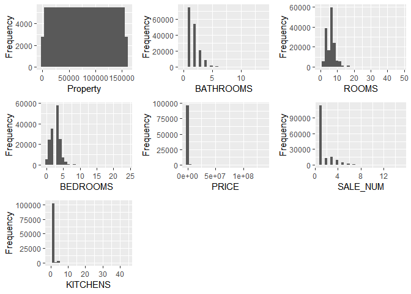

Clustering Houses for Sale
================
Blog Post 3: Brandon Wronker
November 30, 2018

*\_\_\_\_\_\_\_\_\_\_\_\_\_*

**Hello!** I would like to help a real estate company put some of their listings into Clusters so they can better cater their recommendations to their customer! In order to do this, we first need to read in our data and narrow down our dataset to the houses that are the most "normal" so that it can be used in the long term.

``` r
# Set Working Directory
setwd("C:/Users/bwronker/OneDrive/Documents/MSBA UTenn/BZAN 552 Multivariate/Posts")

# Read in our Housing dataset which has specifications on houses for sale
houses <- read.csv("DC_Properties.csv", header = TRUE)

# Let's select the quantitative columns that will help the most with our analysis
houses <- houses[, c(1,2,7,8,14,16,26)]

colnames(houses) <- c("Property", "BATHROOMS", "ROOMS",
                      "BEDROOMS", "PRICE", "SALE_NUM", 
                      "KITCHENS")

str(houses)
```

    ## 'data.frame':    158957 obs. of  7 variables:
    ##  $ Property : int  0 1 2 3 4 5 6 7 8 9 ...
    ##  $ BATHROOMS: int  4 3 3 3 2 3 1 3 3 1 ...
    ##  $ ROOMS    : int  8 11 9 8 11 10 5 8 7 6 ...
    ##  $ BEDROOMS : int  4 5 5 5 3 5 2 4 3 2 ...
    ##  $ PRICE    : num  1095000 NA 2100000 1602000 NA ...
    ##  $ SALE_NUM : int  1 1 3 1 1 1 1 1 4 1 ...
    ##  $ KITCHENS : num  2 2 2 2 1 1 2 2 2 1 ...

``` r
#install.packages("DataExplorer")
library(DataExplorer)
```

``` r
DataExplorer::plot_histogram(houses)
```



``` r
# How many NA's do we have in the PRICE column?
length(which(is.na(houses$PRICE) == TRUE))
```

    ## [1] 60741

``` r
# Let's get rid of these
houses <- houses[-which(is.na(houses$PRICE) == TRUE),]

# Let's get rid of any houses that are over $1.5 Million
houses <- houses[-which(houses$PRICE > 900000),]

# Let's remove outliers & oddities
houses <- houses[-which(is.na(houses$KITCHENS) == TRUE),]
houses <- houses[-which(houses$PRICE < 200000),]
houses <- houses[-which(houses$BATHROOMS > 5),]
houses <- houses[-which(houses$ROOMS > 18),]
houses <- houses[-which(houses$BEDROOMS > 5),]
houses <- houses[-which(houses$SALE_NUM > 10),]
houses <- houses[-which(houses$KITCHENS > 5),]
```

``` r
str(houses)
```

    ## 'data.frame':    36248 obs. of  7 variables:
    ##  $ Property : int  19 27 37 45 46 48 50 54 55 58 ...
    ##  $ BATHROOMS: int  3 3 2 3 3 2 2 1 3 1 ...
    ##  $ ROOMS    : int  9 9 8 10 9 8 8 4 8 4 ...
    ##  $ BEDROOMS : int  3 3 4 5 4 3 3 2 3 1 ...
    ##  $ PRICE    : num  592250 703700 339500 450000 846000 ...
    ##  $ SALE_NUM : int  1 1 1 1 1 1 1 1 1 1 ...
    ##  $ KITCHENS : num  2 4 2 2 2 2 2 2 2 2 ...

**We** can see that we've eliminated 122,759 rows! Let's see if our data looks more representative of typical listings..

``` r
DataExplorer::plot_histogram(houses)
```


**MUCH BETTER!**

**After** removing outliers & oddities in the data, we should normalize the data by using the Scale function. Then, we can perform heirarchical clustering on these houses to help a real estate company create groupings to better serve their clients.

``` r
# install.packages("dplyr")
library(dplyr)
```

    ## 
    ## Attaching package: 'dplyr'

    ## The following objects are masked from 'package:stats':
    ## 
    ##     filter, lag

    ## The following objects are masked from 'package:base':
    ## 
    ##     intersect, setdiff, setequal, union

``` r
# Data is too large so let's take a sample
set.seed(101)
houses_samp <- sample_n(houses, 1500)

for(i in 2:7){
  houses_samp[,i] <- as.numeric(houses_samp[,i])
  }

houses_scaled <- houses_samp[, 2:7]
houses_scaled <- scale(houses_scaled)

d <- dist(houses_scaled, method = "euclidean") 
fit <- hclust(d, method="complete")
plot(fit) 

rect.hclust(fit, k = 5, border = "red")
```


**This dendrogram** shows a decent split at 5 clusters based on the size of our red rectangles. Let's see what the ideal number of clusters is!

``` r
#install.packages('NbClust')
#install.packages('factoextra')
library(NbClust)
library(factoextra)
```

    ## Loading required package: ggplot2

    ## Welcome! Related Books: `Practical Guide To Cluster Analysis in R` at https://goo.gl/13EFCZ

``` r
clusters_s <- NbClust(houses_scaled, distance = "euclidean", min.nc = 3, max.nc = 10, method = "complete")
```


    ## *** : The Hubert index is a graphical method of determining the number of clusters.
    ##                 In the plot of Hubert index, we seek a significant knee that corresponds to a 
    ##                 significant increase of the value of the measure i.e the significant peak in Hubert
    ##                 index second differences plot. 
    ## 


    ## *** : The D index is a graphical method of determining the number of clusters. 
    ##                 In the plot of D index, we seek a significant knee (the significant peak in Dindex
    ##                 second differences plot) that corresponds to a significant increase of the value of
    ##                 the measure. 
    ##  
    ## ******************************************************************* 
    ## * Among all indices:                                                
    ## * 3 proposed 3 as the best number of clusters 
    ## * 9 proposed 4 as the best number of clusters 
    ## * 9 proposed 5 as the best number of clusters 
    ## * 1 proposed 9 as the best number of clusters 
    ## * 1 proposed 10 as the best number of clusters 
    ## 
    ##                    ***** Conclusion *****                            
    ##  
    ## * According to the majority rule, the best number of clusters is  4 
    ##  
    ##  
    ## *******************************************************************

``` r
fviz_nbclust(clusters_s)
```

    ## Among all indices: 
    ## ===================
    ## * 2 proposed  0 as the best number of clusters
    ## * 1 proposed  2 as the best number of clusters
    ## * 3 proposed  3 as the best number of clusters
    ## * 9 proposed  4 as the best number of clusters
    ## * 9 proposed  5 as the best number of clusters
    ## * 1 proposed  9 as the best number of clusters
    ## * 1 proposed  10 as the best number of clusters
    ## 
    ## Conclusion
    ## =========================
    ## * According to the majority rule, the best number of clusters is  4 .


**This shows** the ideal number of clusters is in fact 5. When we split our data into 5 clusters, we see an even split that seems like it would be representative of what we're looking for!

``` r
groups <- cutree(fit, k = 5)

house_clust <- cbind(houses_samp, groups)
house_clust$Property <- as.factor(house_clust$Property)
house_clust$groups <- as.factor(house_clust$groups)
table(house_clust$groups)
```

    ## 
    ##   1   2   3   4   5 
    ## 613 681 100  63  43

``` r
cluster1 <- as.data.frame(cbind(t(colMeans(house_clust[which(house_clust$groups==1), 2:7])),1, 613))

cluster2 <- as.data.frame(cbind(t(colMeans(house_clust[which(house_clust$groups==2), 2:7])),2, 681))

cluster3 <- as.data.frame(cbind(t(colMeans(house_clust[which(house_clust$groups==3), 2:7])),3, 100))

cluster4 <- as.data.frame(cbind(t(colMeans(house_clust[which(house_clust$groups==4), 2:7])),4, 63))

cluster5 <- as.data.frame(cbind(t(colMeans(house_clust[which(house_clust$groups==5), 2:7])),5, 43))

clust_means <- rbind(cluster1, cluster2, cluster3, cluster4, cluster5)
clust_means <- round(clust_means, digits = 3)
clust_means[,7] <- as.factor(clust_means[,7])
clust_means <- clust_means[,c(7,8,1,2,3,4,5,6)]

colnames(clust_means) <- c("Cluster_Num", "Clust_Size", "BATHROOMS", "ROOMS",
                      "BEDROOMS", "PRICE", "SALE_NUM", 
                      "KITCHENS")

clust_means
```

    ##   Cluster_Num Clust_Size BATHROOMS  ROOMS BEDROOMS    PRICE SALE_NUM
    ## 1           1        613     2.343  7.367    3.457 583890.7    2.034
    ## 2           2        681     1.514  6.191    2.739 380325.8    1.545
    ## 3           3        100     3.040  9.360    4.540 669699.2    1.680
    ## 4           4         63     1.873  6.778    3.159 484185.9    5.587
    ## 5           5         43     3.930 13.628    4.093 435287.0    2.000
    ##   KITCHENS
    ## 1    1.165
    ## 2    1.053
    ## 3    1.250
    ## 4    1.063
    ## 5    3.837

**Above** we can see the means of each category for each cluster. BUT, let's improve this visualization before we interpret our clusters!

``` r
library(ggplot2)
colors <- c("firebrick1", "darkorange", "springgreen3", "dodgerblue2", "mediumorchid1")

starter0 <- house_clust[,c(1,8,2,3,4,6,7)]

starter1 <- starter0[,c(1,2,3)]
starter1$aspects <- "BATHROOMS"
colnames(starter1) <- c("Property", "cluster", "number", "aspects")

starter2 <- starter0[,c(1,2,4)]
starter2$aspects <- "ROOMS"
colnames(starter2) <- c("Property", "cluster", "number", "aspects")

starter3 <- starter0[,c(1,2,5)]
starter3$aspects <- "BEDROOMS"
colnames(starter3) <- c("Property", "cluster", "number", "aspects")

starter4 <- starter0[,c(1,2,6)]
starter4$aspects <- "SALE_NUM"
colnames(starter4) <- c("Property", "cluster", "number", "aspects")

starter5 <- starter0[,c(1,2,7)]
starter5$aspects <- "KITCHENS"
colnames(starter5) <- c("Property", "cluster", "number", "aspects")

old <- rbind(starter1, starter2, starter3, starter4, starter5)
old$aspects <- as.factor(old$aspects)

str
```

    ## function (object, ...) 
    ## UseMethod("str")
    ## <bytecode: 0x000000001a628500>
    ## <environment: namespace:utils>

``` r
new <- old %>% 
  group_by(cluster, aspects) %>% 
  dplyr::summarise(mean_a = mean(number))


ggplot(data = new, aes(x = aspects, y = mean_a, fill = cluster)) +
geom_bar(stat="identity", position=position_dodge()) + ggtitle("Aspects of House for Sale by Cluster") + scale_color_manual(values = colors)
```


``` r
ggplot(data = clust_means, aes(x = Cluster_Num, y = PRICE, color = Cluster_Num)) + 
  geom_col(fill = colors) + scale_color_manual(values = colors) + ggtitle("Price") + 
  geom_text(aes(label=PRICE), vjust=1.6, color="white", size=3.5)+
  theme_minimal()
```


**Cluster 1:** Second most expensive houses in the dataset! Very similar to cluster three but possibly slightly older due to the sales number being the only category it beats cluster three in.

**Cluster 2:** Least expensive houses for sale. Lowest in every category actually! Probably great starter homes for young couples!

**Cluster 3:** Most expensive houses; must be very nice!Lots of Bathrooms and the most Bedrooms. Hasn't been on the market very many times!

**Cluster 4:** Relatively average prices homes. One of the smaller homes in the dataset. Most likely older houses due to the high number of previous Sales.

**Cluster 5:** Relatively average prices homes. Tons of Bathrooms and Rooms in general. Relatively young house. Good homes for a more broad audience!

**THANK YOU FOR READING!**
